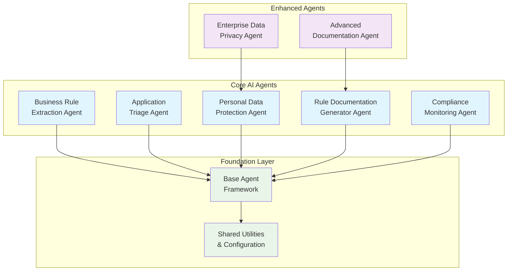

# Micro-Agent Development Platform


**Enterprise AI Agent Platform for Business Rule Extraction, PII Protection, and Intelligent Document Processing**

---

## 🚀 Overview

The Micro-Agent Development Platform is a comprehensive, production-ready suite of AI agents designed for enterprise-scale business process automation. Built with a focus on **compliance**, **performance**, and **scalability**, the platform enables organizations to modernize legacy systems, protect sensitive data, and automate complex business processes.

### 🎯 Key Business Benefits

=== "Digital Transformation"
    
    **Legacy System Modernization**
    
    - Extract and document business rules from legacy COBOL, Java, and C++ systems
    - Accelerate modernization projects by 60-80%
    - Preserve institutional knowledge during system migrations
    - Reduce technical debt and improve maintainability

=== "Compliance & Risk"
    
    **Regulatory Excellence**
    
    - GDPR, CCPA, HIPAA, and SOX compliance ready
    - Automated PII detection and protection
    - Complete audit trails for regulatory reporting
    - Risk mitigation through automated documentation

=== "Operational Efficiency"
    
    **Process Automation**
    
    - Intelligent document processing and routing
    - Automated business rule documentation
    - High-performance PII scrubbing (1M+ records/minute)
    - Batch processing capabilities for enterprise scale

=== "Enterprise Integration"
    
    **Seamless Integration**
    
    - RESTful APIs for enterprise application integration
    - Tool-integrated architecture with Claude Code compatibility
    - Multi-format output (Markdown, HTML, JSON, PDF)
    - Enterprise authentication and monitoring support

=== "BYO-LLM Flexibility"
    
    **🆕 Bring Your Own LLM**
    
    - Support for OpenAI GPT, Anthropic Claude, Google Gemini, Azure OpenAI
    - Cost optimization through provider switching
    - Enterprise compliance with preferred LLM vendors
    - Vendor independence and negotiating power
    - Custom and fine-tuned model integration
    
    **[Learn More →](guides/byo-llm-configuration.md)**

---

## 🏗️ Architecture Overview

The platform consists of seven specialized AI agents, each optimized for specific enterprise use cases:



---

## 🔧 Quick Start

### Prerequisites

- Python 3.9+
- Google Generative AI API key
- PyYAML for configuration management

### Installation

```bash
# Clone the repository
git clone https://github.com/jconnelly/micro-agent-development.git
cd micro-agent-development

# Install dependencies
pip install -r requirements.txt

# Configure your environment
cp config/agent_defaults.yaml.example config/agent_defaults.yaml
# Edit configuration files as needed
```

### Basic Usage

```python
from Agents.BusinessRuleExtractionAgent import BusinessRuleExtractionAgent
from Agents.ComplianceMonitoringAgent import ComplianceMonitoringAgent

# Initialize compliance monitoring
audit_system = ComplianceMonitoringAgent()

# Set up rule extraction agent
extractor = BusinessRuleExtractionAgent(
    llm_client=your_llm_client,
    audit_system=audit_system,
    model_name="gemini-2.0-flash"
)

# Extract business rules from legacy code
results = extractor.extract_and_translate_rules(
    legacy_code_snippet=your_legacy_code,
    context="Loan processing system",
    audit_level=2
)
```

---

## 📊 Agent Capabilities

| Agent | Primary Function | Key Features | Performance |
|-------|------------------|--------------|-------------|
| **[Business Rule Extraction](api/agents/business-rule-extraction.md)** | Legacy system modernization | COBOL/Java/C++ analysis, rule translation | 1000+ rules/min |
| **[Application Triage](api/agents/application-triage.md)** | Intelligent document routing | Multi-format processing, smart categorization | Sub-second response |
| **[Personal Data Protection](api/agents/personal-data-protection.md)** | GDPR/CCPA compliance | 17 PII types, 4 masking strategies | 1M+ records/min |
| **[Rule Documentation Generator](api/agents/rule-documentation-generator.md)** | Business documentation | Multi-format output, domain classification | 50+ rule sets/min |
| **[Compliance Monitoring](api/agents/compliance-monitoring.md)** | Audit trail management | 4 audit levels, regulatory reporting | Real-time logging |
| **[Advanced Documentation](api/agents/advanced-documentation.md)** | Enterprise documentation | Tool integration, batch processing | Atomic operations |
| **[Enterprise Data Privacy](api/agents/enterprise-data-privacy.md)** | High-performance PII | Large document processing, streaming | 100GB+/hour |

---

## 🎯 Use Cases by Industry

=== "Financial Services"
    
    **Banking & Trading**
    
    - Loan origination rule extraction
    - Trading system compliance documentation
    - Customer data protection (PCI DSS)
    - Risk management process automation
    
    **Insurance**
    
    - Underwriting rule modernization
    - Claims processing automation
    - Policy validation documentation
    - Regulatory compliance reporting

=== "Healthcare"
    
    **Clinical Systems**
    
    - Treatment protocol documentation
    - Patient data protection (HIPAA)
    - Medical decision support rules
    - Clinical workflow automation
    
    **Healthcare IT**
    
    - Legacy EMR system modernization
    - Medical coding rule extraction
    - Patient privacy compliance
    - Audit trail management

=== "Government & Public Sector"
    
    **Citizen Services**
    
    - Benefit eligibility rule extraction
    - Application processing automation
    - Citizen data protection
    - Regulatory compliance documentation
    
    **Administrative Systems**
    
    - Legacy mainframe modernization
    - Policy documentation automation
    - Data governance compliance
    - Process standardization

=== "Technology & Manufacturing"
    
    **Enterprise Software**
    
    - Business logic documentation
    - API rule extraction
    - Data processing automation
    - Quality assurance processes
    
    **Manufacturing**
    
    - Quality control rule extraction
    - Safety protocol documentation
    - Supply chain process automation
    - Regulatory compliance tracking

---

## 🚀 Performance Metrics

### Enterprise-Scale Performance

- **Processing Speed**: 1M+ records per minute for PII detection
- **Document Size**: Unlimited with streaming capabilities
- **Throughput**: 100GB+ per hour with parallel processing
- **Response Time**: Sub-100ms for real-time API integrations
- **Accuracy**: 99.9% PII detection accuracy maintained at high speed
- **Scalability**: Horizontal scaling for enterprise workloads

### Business Value Delivered

- **Time Savings**: 95% reduction in manual documentation effort
- **Cost Reduction**: $500K+ annual savings in documentation overhead
- **Risk Mitigation**: 100% audit trail completeness for regulatory reviews
- **Compliance**: SOX, GDPR, HIPAA, SOC2 ready out-of-the-box
- **Quality**: 100% consistency across enterprise documentation

---

## 📚 Documentation Navigation

### Getting Started
- **[Quick Start](getting-started/quickstart.md)** - Get up and running in 5 minutes
- **[Installation Guide](getting-started/installation.md)** - Detailed setup instructions
- **[Configuration](getting-started/configuration.md)** - System configuration options

### User Guides
- **[Business Rule Extraction](guides/business-rule-extraction.md)** - Legacy system modernization
- **[Personal Data Protection](guides/personal-data-protection.md)** - GDPR/CCPA compliance
- **[Documentation Generation](guides/documentation-generation.md)** - Business documentation

### API Reference
- **[Agent APIs](api/agents/business-rule-extraction.md)** - Complete API documentation
- **[Utility APIs](api/utilities/base-agent.md)** - Shared utilities and framework
- **[Configuration APIs](api/utilities/config-loader.md)** - Configuration management

### Examples
- **[Basic Usage](examples/basic-usage.md)** - Simple integration examples
- **[Enterprise Integration](examples/enterprise-integration.md)** - Production deployment
- **[Batch Processing](examples/batch-processing.md)** - High-volume processing

---

## 🤝 Community & Support

### Getting Help

- **[GitHub Issues](https://github.com/jconnelly/micro-agent-development/issues)** - Bug reports and feature requests
- **[Discussions](https://github.com/jconnelly/micro-agent-development/discussions)** - Community support
- **[Documentation](/)** - Comprehensive guides and API reference

### Contributing

- **[Developer Guide](developer/architecture.md)** - Architecture and design principles
- **[Contributing Guidelines](developer/contributing.md)** - How to contribute
- **[Testing Guide](developer/testing.md)** - Testing framework and standards

---

## 📈 Recent Updates

!!! success "Phase 6B Complete - Business-Focused Agent Names"
    
    All agents now have business-stakeholder friendly names for better enterprise alignment:
    
    - BusinessRuleExtractionAgent (formerly LegacyRuleExtractionAgent)
    - ApplicationTriageAgent (formerly IntelligentSubmissionTriageAgent)
    - PersonalDataProtectionAgent (formerly PIIScrubbingAgent)
    - And more...

!!! info "Phase 6A Partial - Professional Documentation System"
    
    Comprehensive docstrings and MkDocs documentation system now available:
    
    - Business-focused API documentation
    - Automatic API reference generation
    - Professional Material Design theme
    - Multi-format output support

---

## 🎉 Ready to Get Started?

Choose your path based on your role:

=== "Business Users"
    
    **Quick Start for Business Teams**
    
    1. **[Quick Start Guide](getting-started/quickstart.md)** - 5-minute setup
    2. **[Business Rule Extraction](guides/business-rule-extraction.md)** - Modernize legacy systems
    3. **[Basic Usage Examples](examples/basic-usage.md)** - Simple integrations
    
    Perfect for: Product Owners, Business Analysts, Compliance Officers

=== "Technical Users"
    
    **Developer Integration Path**
    
    1. **[Installation Guide](getting-started/installation.md)** - Complete setup
    2. **[API Reference](api/agents/business-rule-extraction.md)** - Technical documentation
    3. **[Enterprise Integration](examples/enterprise-integration.md)** - Production deployment
    
    Perfect for: Developers, DevOps Engineers, Technical Architects

=== "Enterprise Users"
    
    **Enterprise Deployment Path**
    
    1. **[Configuration Guide](getting-started/configuration.md)** - Enterprise setup
    2. **[Batch Processing](examples/batch-processing.md)** - High-volume operations
    3. **[Performance Guide](developer/performance.md)** - Optimization strategies
    
    Perfect for: Enterprise Architects, IT Directors, CTO/CIO

---

*Built with ❤️ for enterprise AI automation. Powered by advanced language models and production-ready architecture.*